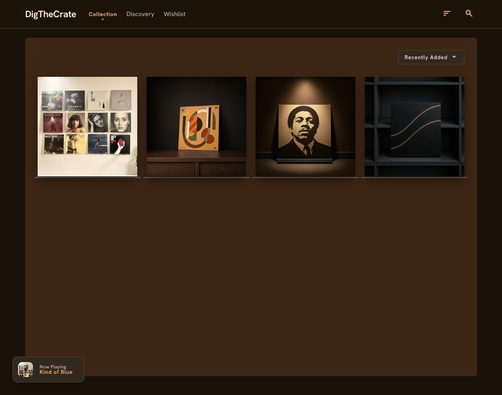
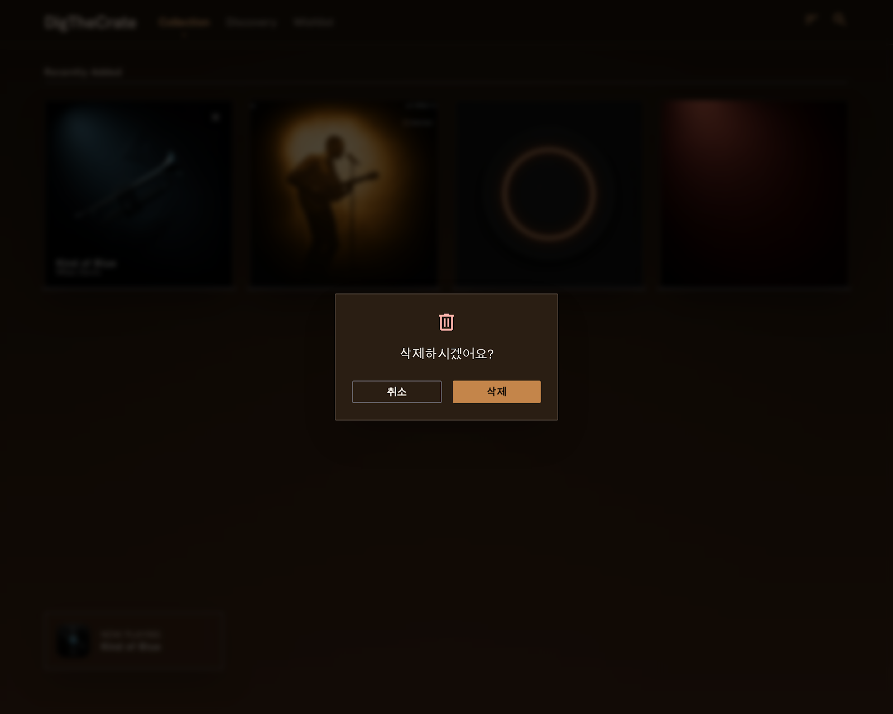
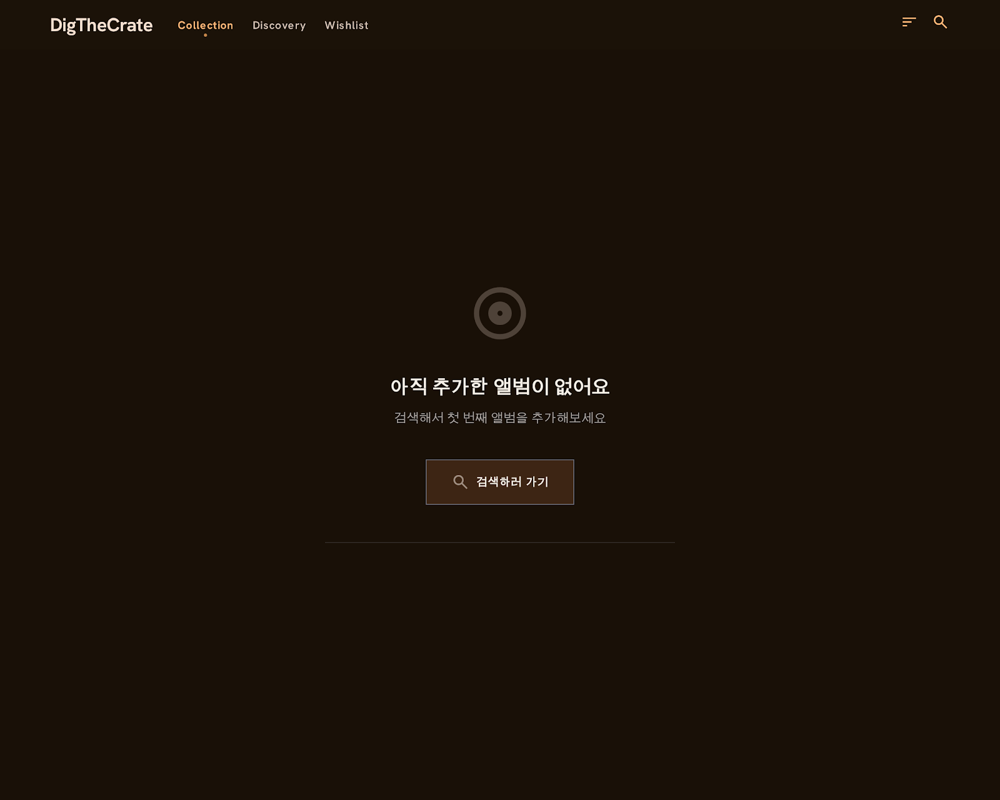
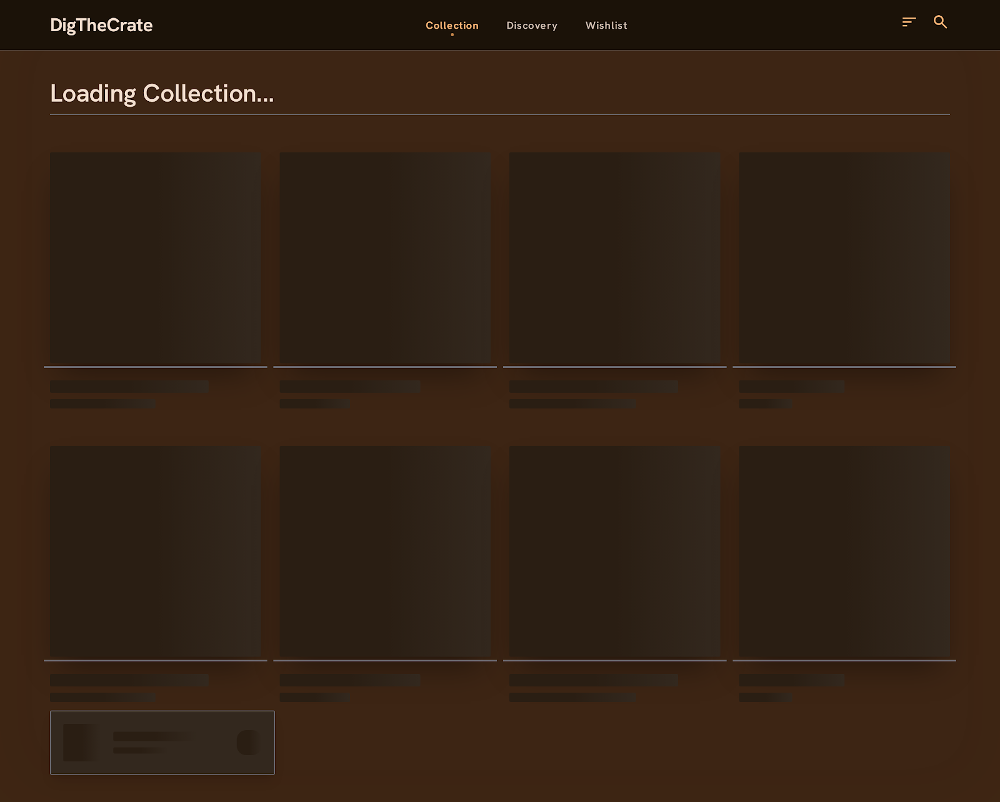
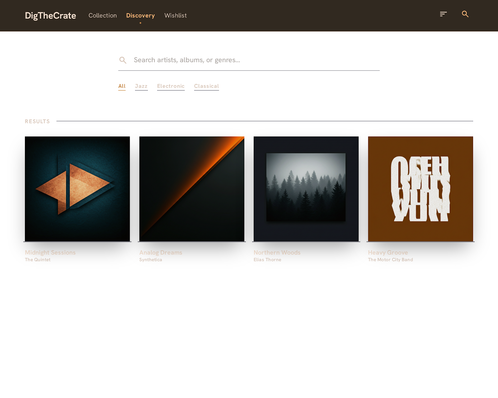
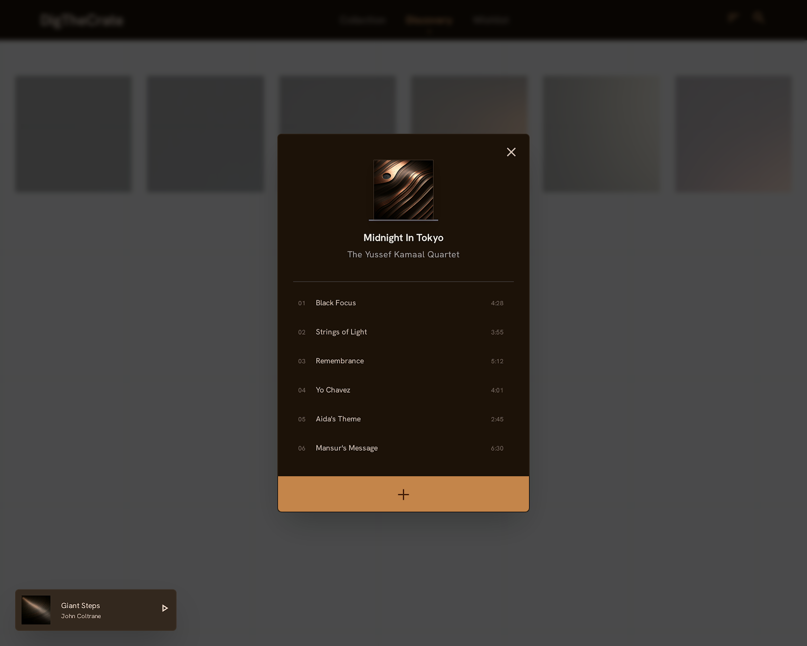
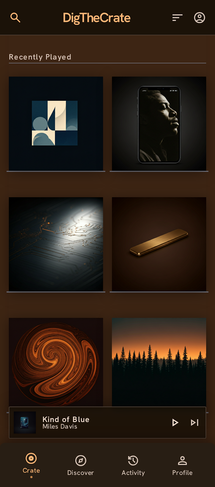
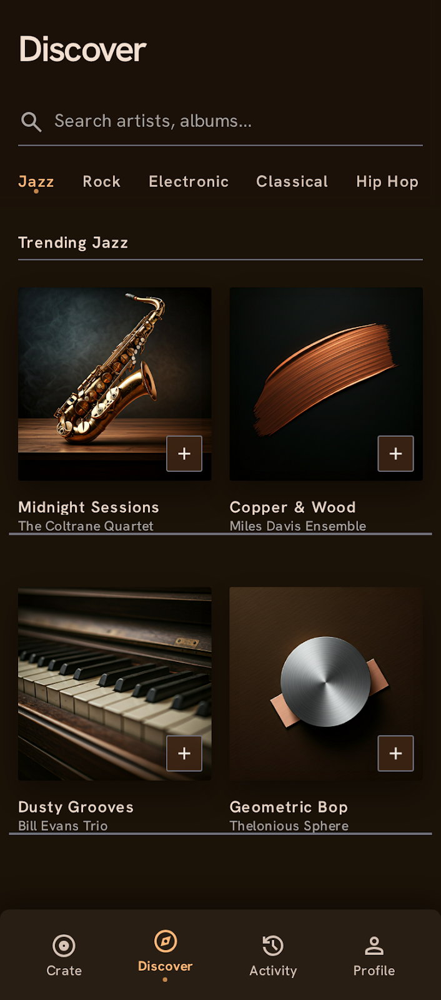

# DigTheCrate Design Guide

## 컨셉

어두운 레코드샵에서 LP를 구경하는 느낌.
앨범 커버가 주인공이고, 배경은 그걸 돋보이게 하는 역할.
메인 페이지는 따뜻한 우드톤 다크, 검색 페이지는 밝고 깔끔한 화이트.

---

## 색상 토큰

### 메인 페이지 (다크 테마)

| 역할             | Hex       | 설명                          |
| ---------------- | --------- | ----------------------------- |
| `bg-page`        | `#1A1108` | 페이지 전체 배경 (에스프레소) |
| `bg-wall`        | `#3D2514` | 컬렉션 영역 배경 (다크 월넛)  |
| `bg-card`        | `#2A1E13` | 카드 배경                     |
| `bg-header`      | `#120D07` | 헤더 배경                     |
| `text-primary`   | `#F5F0E8` | 주요 텍스트 (웜 크림)         |
| `text-secondary` | `#A8A29E` | 보조 텍스트 (웜 그레이)       |
| `text-muted`     | `#6B5E52` | 비활성 텍스트                 |
| `accent`         | `#C4854A` | 포인트 컬러 (웜 코퍼)         |
| `accent-hover`   | `#D4956A` | 포인트 호버                   |
| `border`         | `#3A2C22` | 테두리                        |
| `metal`          | `#71717A` | 철재 받침대 컬러              |

### 검색 페이지 (라이트 테마)

| 역할                    | Hex       | 설명               |
| ----------------------- | --------- | ------------------ |
| `bg-search`             | `#FAFAFA` | 검색 페이지 배경   |
| `text-search-primary`   | `#1C1208` | 주요 텍스트        |
| `text-search-secondary` | `#78716C` | 보조 텍스트        |
| `border-search`         | `#E7E5E4` | 구분선             |
| `accent-search`         | `#C4854A` | 포인트 컬러 (동일) |

### 공통

| 역할             | Hex               | 설명                    |
| ---------------- | ----------------- | ----------------------- |
| `form`           | `#281E14`         | auth 폼 카드 배경       |
| `field`          | `#1B1209`         | 인풋 필드 배경          |
| `disabled`       | `#4A3E35`         | 비활성 버튼 배경        |
| `dimmed`         | `rgba(0,0,0,0.7)` | 카드 뒤집기 시 오버레이 |
| `skeleton-base`  | `#2A1E13`         | 스켈레톤 기본           |
| `skeleton-shine` | `#3D2F22`         | 스켈레톤 shimmer        |

---

## 타이포그래피

```
폰트 패밀리
- 로고: Inter (Bold 700) 또는 별도 커스텀 폰트
- UI 전반: Inter
- 앨범명: Inter Medium (500)
- 아티스트명: Inter Regular (400)
```

| 역할        | 크기 | 굵기                             |
| ----------- | ---- | -------------------------------- |
| 로고        | 20px | 700                              |
| 섹션 레이블 | 12px | 500, 자간 넓게 (tracking-widest) |
| 앨범명      | 13px | 500                              |
| 아티스트명  | 12px | 400                              |
| 버튼 텍스트 | 13px | 500                              |
| 네비 링크   | 14px | 400                              |

---

## 레이아웃

### 전체 구조

```
헤더 (고정, h-14)
└── 로고 (좌)
└── 네비게이션 (중앙)
└── 정렬 드롭다운 + 검색 아이콘 (우)

컨텐츠 영역
└── 메인: 우드톤 벽 배경 + 앨범 그리드
└── 검색: 화이트 배경 + 검색창 + 결과

미니 플레이어 (고정, 좌하단) ← Phase 2
```

### 그리드

```
데스크탑: 4열, gap-4
태블릿:   3열, gap-3
모바일:   2열, gap-3
```

### 카드 비율

```
앨범 커버: aspect-ratio 1:1 (정사각형 고정)
카드 최소 너비: 180px
```

---

## 컴포넌트

### 헤더

```
배경: bg-header (#120D07)
하단 테두리: border-b border-[#3A2C22]
높이: h-14
패딩: px-6

네비 링크
- 기본: text-secondary
- 활성: text-accent + 하단 dot indicator
- 호버: text-primary
```

### 앨범 카드 (메인 페이지)

```
배경: 이미지가 100% 채움
받침대: 카드 하단에 metal 컬러 얇은 라인 (h-1, bg-metal)
border-radius: rounded-sm

호버 시
- 앨범명 + 아티스트명 하단에서 fade in
  (배경: linear-gradient 투명 → 반투명 블랙)
- 우상단 X 버튼 등장 (circle, bg-black/50)

스켈레톤
- 같은 크기, bg-skeleton-base
- shimmer 애니메이션
```

### 앨범 카드 뒤집기 (검색 페이지)

```
클릭 시
- CSS 3D transform: rotateY(180deg) + scale(1.05)
- 배경 dimmed 오버레이 등장 (클릭하면 닫힘)
- transition: 0.4s ease

앞면: 앨범 커버
뒷면 (bg-[#1C1208])
- 앨범명 (text-primary, 16px, 600)
- 아티스트명 (text-secondary, 14px)
- 수록곡 목록 (text-muted, 12px, 스크롤 가능)
- 추가 버튼 (하단 고정)
- 우상단 X 버튼

추가 버튼 상태
- 기본: + 아이콘, bg-accent
- 이미 추가됨: ✓ 아이콘, bg-disabled, cursor-not-allowed
- 처리 중: disabled + 색상 변경
```

### 검색창

```
배경: transparent
하단 테두리만 표시 (border-b)
텍스트: text-search-primary
placeholder: text-search-secondary
아이콘: 좌측 돋보기

로딩 중: 결과 영역에 스피너 (중앙 정렬)
결과 없음: "검색 결과가 없어요" 텍스트 (중앙)
```

### 장르 탭

```
탭 목록: All / Jazz / Rock / Electronic / Classical / Hip Hop / R&B

기본: text-search-secondary, border-b-2 border-transparent
활성: text-accent, border-b-2 border-accent
호버: text-search-primary
```

### 정렬 드롭다운

```
위치: 컬렉션 영역 우측 상단
스타일: 텍스트 + 화살표 아이콘
선택지
- Recently Added (기본)
- Artist Name
- Album Name
- Release Year
```

### 미니 플레이어 (Phase 2)

```
위치: fixed, bottom-6, left-6
크기: w-52, h-16
배경: bg-[#1C1208], border border-[#3A2C22]
border-radius: rounded-xl
shadow: shadow-xl

내용
- 앨범 커버 썸네일 (좌, w-10, rounded-sm)
- "Now Playing" 레이블 (text-muted, 10px)
- 앨범명 (text-primary, 12px, 500)
```

---

## 인터랙션 규칙

```
버튼 기본
→ cursor-pointer 항상 포함 (모든 버튼 공통)

버튼 처리 중 (API 호출)
→ disabled 상태
→ 배경색 bg-disabled (#4A3E35)
→ 커서 cursor-not-allowed (disabled일 때만 예외)
→ 버튼 내부 스피너 없음

삭제 확인
→ 브라우저 기본 confirm 대신 커스텀 모달 또는 토스트로
→ "삭제하시겠어요?" + 확인/취소 버튼

에러 토스트
→ 우하단 fixed
→ 배경 bg-[#2A1208], 텍스트 text-primary
→ 3초 후 자동 사라짐
```

---

## 반응형 브레이크포인트

```
모바일:  < 640px  → 2열 그리드
태블릿:  640px~   → 3열 그리드
데스크탑: 1024px~ → 4열 그리드
```

---

## 이미지 최적화 (Phase 1 최적화 단계)

```
초기 구현 (최적화 전)
→ 
→ 모든 이미지 즉시 로드

최적화 적용 후
→ Intersection Observer로 뷰포트 진입 시 로드
→ aspect-ratio: 1/1 고정 (CLS 방지)
→ Discogs 썸네일 먼저 로드 후 blur 처리
→ 원본 로드 완료 시 blur 제거 + fade in
```

---

## 애니메이션 (Phase 2)

```
카드 뒤집기: rotateY(180deg), 0.4s ease, CSS transform
LP 회전: rotate infinite linear, CSS animation (JS setInterval 금지)
카드 호버 정보: opacity 0 → 1, 0.2s ease
미니 플레이어 등장: translateY(100%) → 0, 0.3s ease
```

---

## UI 레퍼런스

컴포넌트 구현 전 반드시 해당 화면의 레퍼런스 이미지를 확인한다.

### 메인 페이지

**기본 상태**


**호버 + 삭제 확인**


**빈 상태 (EmptyCollection)**


**스켈레톤 로딩**


---

### 검색 페이지

**기본 상태**


**카드 뒤집기 + dimmed**


---

### 모바일

**모바일 메인**


**모바일 검색**

