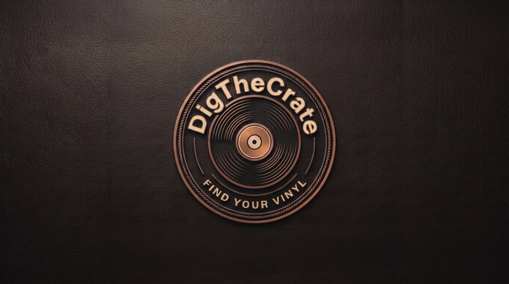
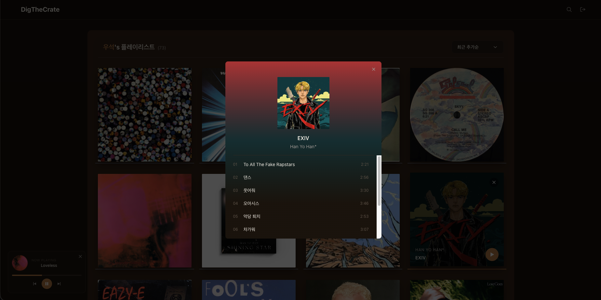

## 🎵 Dig The Crate



### 📌 프로젝트 소개

소장한 LP를 검색하고 등록해서 나만의 컬렉션으로 관리합니다.
앨범 커버 이미지, 수록곡을 포함한 앨범 정보를 제공하고, 각 앨범의 수록곡 중 한 곡에 대해 30초 미리듣기도 지원합니다.

---

### 🧑‍💻 기술 스택

```
프레임워크   Vite + React 18 + TypeScript
스타일링     TailwindCSS
서버 상태    TanStack Query
백엔드/인증  Supabase (Auth + DB)
라우팅      react-router
코드 품질    ESLint + Prettier
배포        Vercel
```

---

### ✨ 핵심 기능

- 로그인 / 회원가입
- 앨범 검색 / 개인 컬렉션에 추가·삭제
- Discogs 검색으로 앨범 정보 및 커버 이미지 가져오기
- 30초 미리듣기 + 미니 LP 플레이어



---

### 📦 폴더 구조

```
src/
├── lib/          # Supabase 클라이언트, TanStack Query 설정
├── services/     # Discogs / Supabase API 호출 함수
├── hooks/        # 커스텀 훅
├── components/   # UI 컴포넌트
├── pages/        # 라우트 페이지
├── types/        # 타입 정의
├── utils/        # 유틸 함수
└── workers/      # Web Worker (앨범 커버 색상 추출 위임)
```

자세한 구조는 [`docs/ARCHITECTURE.md`](./docs/ARCHITECTURE.md) 참고

---

### 🗄️ 더 알아보기

작업 히스토리, 기술적 결정, 트러블슈팅 기록은 [Wiki](https://github.com/chldntjr1321/Dig-The-Crate/wiki)에 정리되어 있습니다.
